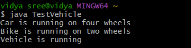

# java-lab-cse-g-5ef-5b
# EXPERIMENT -5B
## implementation of run time polymorphism
source code 
```

class Vehicle {
    void run() {
        System.out.println("Vehicle is running");
    }
}


class Car extends Vehicle {
    @Override
    void run() {
        System.out.println("Car is running on four wheels");
    }
}

class Bike extends Vehicle {
    @Override
    void run() {
        System.out.println("Bike is running on two wheels");
    }
}

public class TestVehicle {
    public static void main(String[] args) {
        Vehicle v;

        v = new Car();
       v.run();

        v = new Bike();
        v.run();

        v = new Vehicle();
        v.run();
    }
}

```
# output : 

